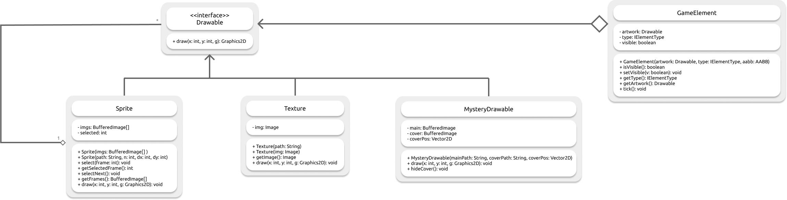
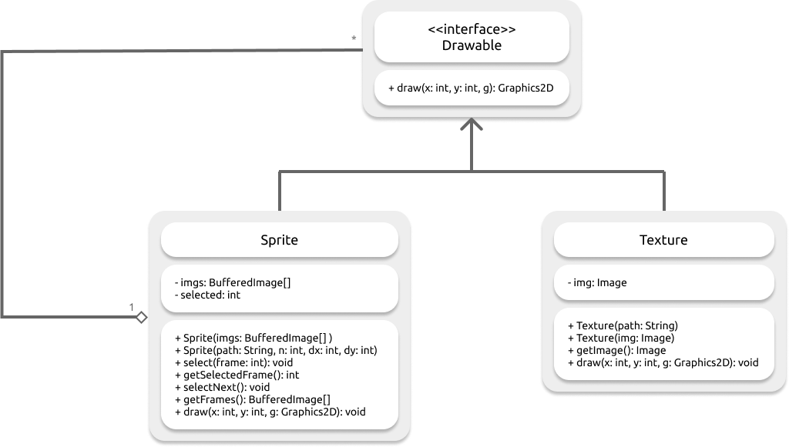
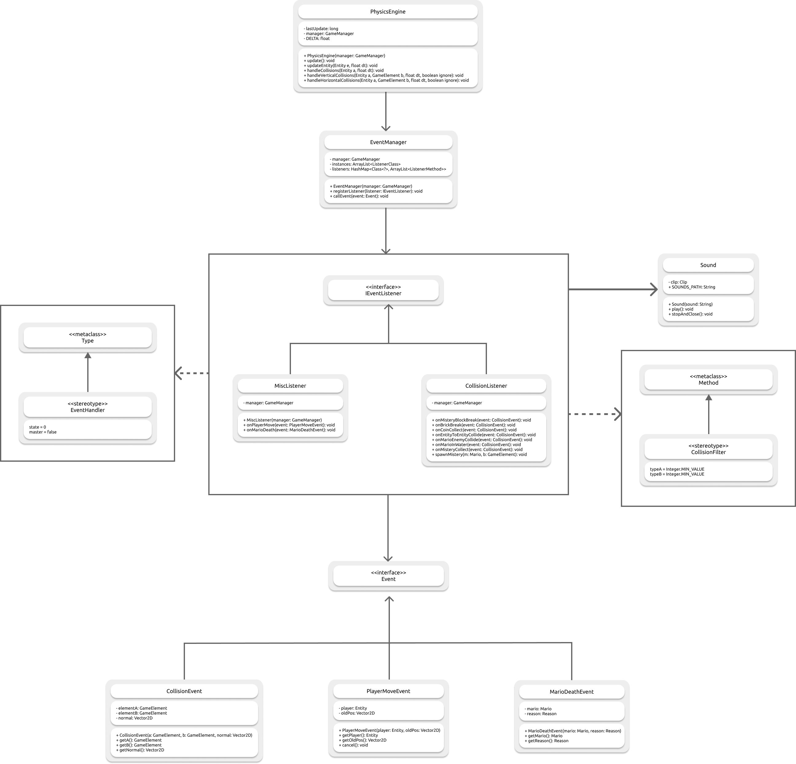
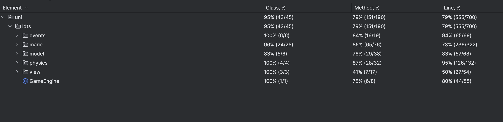
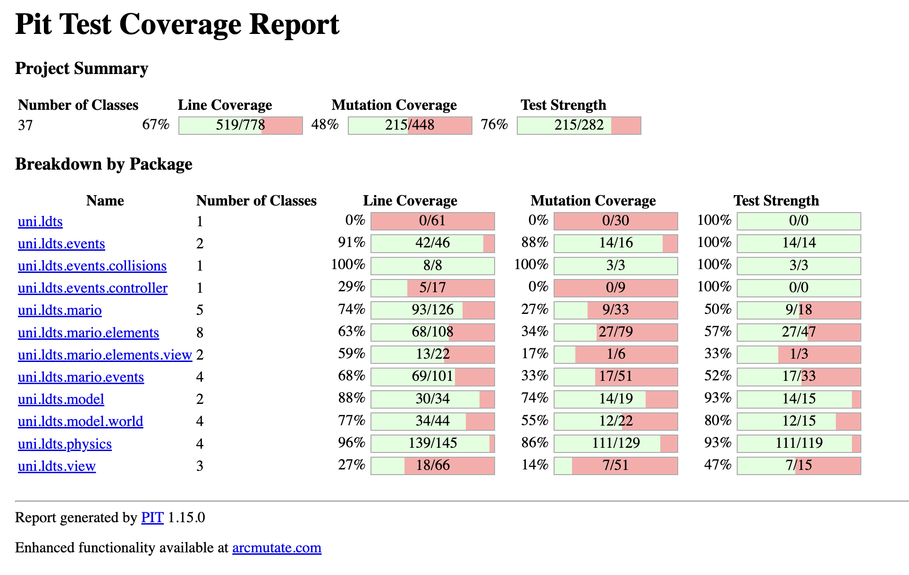

## LDTS_0303 - Super Mario, Remastered

Embark on a nostalgic journey through a magical, pixelated world while facing off familiar enemies, collecting coins to boost your score and power-ups to increase your odds – will you take the challenge?

Project developed by
*Nuno Rios* (*up202206272*@up.pt),
*Gonçalo Marques* (*up202206205*@up.pt) and
*Ricardo Ramos* (*up202206349*@up.pt)

### Features implemented

- **Fight enemies** - Take the risk and defeat your enemies by jumping on top of their heads.
- **Move around** - It's simple - press the space bar to jump and use the arrow keys to move around.
- **Gather power-ups** - Find hidden mysteries across the map and gather all the power-ups.

### Gameplay Video

Here is a snippet of the gameplay:

https://github.com/FEUP-LDTS-2023/project-l03gr03/assets/132064133/7d00ccdc-d4dd-4002-9bb0-1316d70ce7af

### Design

- **Problem in Context.** It is quite easy to violate the **Single Responsibility Principle**, we do it without even realizing, therefore, we need a way to tackle this and prevent this mistake.

- **The Pattern.** In order to minimize this kind of mistakes we used the **Model-View-Controller(MVC)** architectural pattern.

- **Implementation** 

- **Consequences.** As a result of this pattern, we will avoid mistakes that would cost us time and would make our source code not very friendly.

------

- **Problem in Context.** While thinking about the project, we realised we would have multiple Game Elements and consequently multiple representations such as blocks and enemies. In order to reduce repetition, we were able to divide the visual representation of each GameElement(either a block, item or entity) into three different classes, sprite and texture. Firstly, a texture is representation of a GameElement that has no animation, so it has no changes thorough the game. Secondly, a sprite is no more than a combination of images or "Textures". Therefore, whenever a GameElement has some sort of animation it will have a Sprite as its Drawable. Thirdly, we have the MisteryDrawable which is the representation of the item inside a MisteryBlock. It is a very specific case and, therefore, required a specific Drawable subclass.

- **The Pattern.** We have applied the **Strategy** pattern. This pattern allowed us to be able to reuse code in every GameElement as the methods to represent them were always the same, the only difference was the image it would draw and the potential animation it would have.

- **Implementation** 

- **Consequences.** Apart from the game in itself, our goal was to make a game engine that could, basically, run every single 2D game you can imagine. Therefore, it would not make any sense to specify the type of view each GameElement would have because every element has a unique view and therefore there was no potential reuse of those views at all.

------

- **Problem in Context.** Something we were somewhat worried about was the way our GameElements would be animated. It would be boring to have a Mario that is the same while running and jumping and even bit depressing to not have Koopa's animation of opening and closing his mouth. In order to be able to handle this issue properly we used **Sprite** class which in its root is a group of textures. There, you can select which texture is currently active in order to make the proper animation changes.

- **The Pattern.** To tackle this, we decided to use the **Composite Pattern** in order to be able animate our characters in a friendly way.

- **Implementation** 

- **Consequences.** As a consequence of choosing this design, we will be able to add new powerUps without the need to specify in which blocks they will be in. Also, it will make the game more exciting because the players will never know what to expect from each block.

------

- **Problem in Context.** One big detail in our design was the way the character interacts with its enemies. Depending on which state the character is in, **is he jumping ?** or **does he have a PowerUp?**, this interaction will not be the same. As a result, in the long run, if he opted to simply do a bunch of if's and else's, we would be painful to watch and violating the **Open-Closed Principle**. In fact, this would be even more problematic taking into account the innumerous events that happen at every game tick because we do not have to deal only with the character-related events, there are many others such as, collision between enemies, or between enemies and objects.

- **The Pattern.** The pattern that we applied was the **Observer Pattern**. In this way, when a relevant event occurs, every interested component will be notified and will make the proper changes as a reaction to the event. This was a quite challenging issue to tackle, therefore, we come up with a modified version of the observer pattern. In order to minimize resource usage we used annotation in order to restrict the observers to be notified. This is because, the character only cares when the user presses space when it is not in a menu, for example. So with this modified version, developers are able to notify only the interested observers.

- **Implementation** 

- **Consequences.** As a result, if we want to add new enemies, or new items, we would only need to write a simple method that would handle the potential events involving that new enemy or item.

------

### Code smells

We have solved all identified code smells, and even though there are still some extensive classes, we were not able to find a viable alternative in time.

------

### Testing

- **Test Coverage**   

  
- **Mutation Testing**
  

- For more detailed information about mutation testing click [here](./resources/pitest)

  
------

### Self evaluation

- From modularity to an event driven design, Nuno Rios's main focus went to building the foundation of the game, the engine. He also took part in building the game on top of the engine, Super Mario (which is inside uni.ldts.mario).
- Game physics (physics engine) took a long time to implement and Gonçalo Marques helped bring the final implementation to life. He, too, spent a significant amount of time in piecing Super Mario together and building the game tests.
- Ricardo Ramos helped in Super Mario and its assets and implemented some tests.
